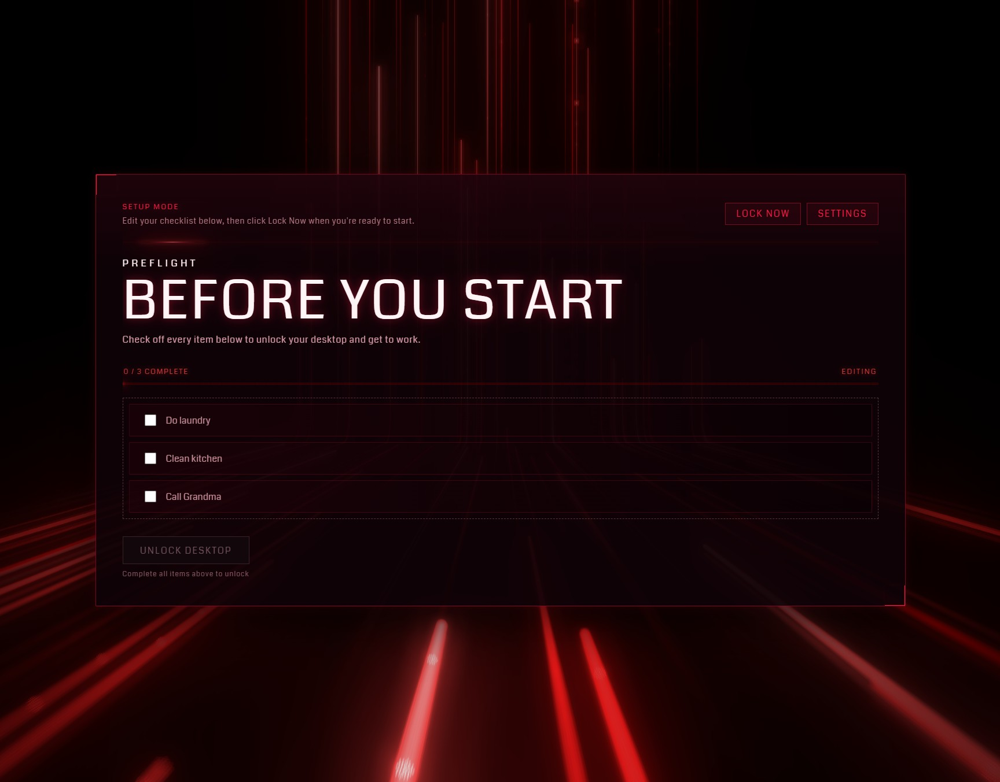

# PreFlight

A Windows-first Electron checklist gate for starting the day deliberately.

PreFlight sits between waking your computer and falling into autopilot. It opens in setup mode for editing a daily checklist, then can switch into a locked fullscreen overlay that only releases when every item is complete. The interesting part is the combination: a practical local productivity tool, a hardened Electron windowing experiment, and a deliberately cinematic lock screen built with React, Three.js, and a red neon visual system.

## Screenshots / Visual



## Features

### Lock Screen

- The lock screen gates the desktop behind a local checklist and unlocks automatically once every item is complete.
- The primary overlay uses a bundled Three.js neon corridor background with WebGL shaders, bloom, SMAA, foreground blur, and no external CDN script requests.
- The interface uses the Coda typeface from Google Fonts, with a red 80s dashboard treatment layered over the animated corridor.
- The scan bar uses a soft falloff beam and an invisible reset sweep, so the animation reads like light instead of a sliding block.
- The progress bar includes segment ticks, a glowing fill, and a bright leading tip that makes checklist progress legible at a glance.
- Locked mode can cover secondary monitors with blocker windows, or leave them usable when the user disables secondary screen blocking.

### Setup & Configuration

- Setup mode and locked mode are visually distinct, so editing the checklist never feels like being trapped in the lock surface.
- The settings screen is a full-window charcoal panel with its own quieter aesthetic, separate from the red lock dashboard.
- Checklist items are editable locally, with daily completion state reset by local date.
- The edit window resizes to fit the current checklist height, clamped to the primary display work area.
- Settings include startup/wake locking and a secondary screen blocking toggle for workflows that keep music, reference material, or chat visible.
- User-facing copy is plain language throughout the app; the UI avoids development jargon even though the internals are intentionally inspectable.

## How It Works

PreFlight has two modes. Setup mode is a normal window for editing the checklist and choosing how aggressive the lock should be. Locked mode is a fullscreen, frameless, always-on-top overlay on the primary monitor. When secondary blocking is enabled, the app also creates blocker windows for every non-primary display.

The checklist is the gate. Item definitions and completion state live in Electron's `userData` directory, and completion is keyed by local date. In locked mode, checking the final item automatically tears down the overlay, closes secondary blockers, restores the desktop state, and leaves PreFlight available from the system tray.

The visual direction is intentionally specific: black glass, red instrumentation, Coda lettering, and a moving Three.js corridor under the UI. The background is bundled through Vite from the local `three` package, and the renderer CSP allows the local shader compilation path required by WebGL without adding external script domains.

## Getting Started

```bash
npm install
npm run dev
```

Build the app:

```bash
npm run build
```

Run the built Electron app:

```bash
npm run start
```

## Development Modes

| Command | Description |
| --- | --- |
| `npm run dev` | Runs the Vite renderer and Electron app with the normal lock-capable development path. |
| `npm run dev:debug` | Runs a safer windowed debugging mode with DevTools and verbose renderer diagnostics. |
| `npm run dev:safe` | Alias for `npm run dev:debug`. |

## Lock Hardening

PreFlight hardens lock mode only after the renderer reports a successful load. If the renderer fails to load, crashes, or does not finish within eight seconds, the app disengages the lock, restores Explorer, closes blocker windows, and shows a safe exit screen instead of leaving the user behind a broken overlay.

While locked, PreFlight combines Electron user-space controls with Windows shell suppression. It keeps the primary window fullscreen and topmost, refocuses it after blur events, clamps monitor bounds when Windows moves a window, optionally covers secondary displays, prevents display sleep, and restores Explorer when lock mode ends or the app exits.

| Surface | Electron User-Space Status | Notes |
| --- | --- | --- |
| `Alt+F4` | Blockable | Handled with global shortcuts and renderer input interception. |
| `Alt+Tab` | Best-effort | Electron can register it on some systems, but Windows may reserve it. |
| `Win+Arrow` | Best-effort plus clamped | Shortcut registration is best-effort; move events are corrected by bounds clamping. |
| `Win+D`, `Win+M`, `Win+Tab`, `Ctrl+Escape`, `Win+E`, `Win+R` | Best-effort | Registered while locked and paired with Explorer shutdown where applicable. |
| Taskbar and Start menu | Suppressed on Windows | `explorer.exe` is killed during lock and restored afterward. |
| `Ctrl+Alt+Del` | Not blockable | Secure attention sequence is reserved by Windows. |
| Windows key alone | Not reliably blockable | Reserved shell behavior; user-space Electron apps should not depend on intercepting it. |
| `Win+L` | Not reliably blockable | Workstation locking is OS-reserved on many Windows configurations. |
| Power button, firmware keys, external admin tools | Not blockable | Requires OS policy, kiosk configuration, or hardware/MDM controls outside Electron. |

## Configuration & Local Data

PreFlight stores its checklist, daily completions, and settings in Electron's `userData` directory as `preflight-store.json`. On Windows, that is under the app data folder for the current user. To reset everything, close PreFlight and remove the app data directory:

```powershell
Remove-Item "$env:APPDATA\PreFlight" -Recurse -Force
```

The startup/wake setting is controlled from Settings and uses Electron's login item support. When enabled, PreFlight starts in locked mode on launch and re-enters locked mode after `powerMonitor.resume`. The secondary screen blocking setting is also stored locally; when it is off, only the primary monitor is blocked during locked mode.

## Windows Packaging

Create an unpacked Windows executable:

```bash
npm run package
```

Create the installer target:

```bash
npm run dist
```

The unpacked executable is written to:

```text
release/win-unpacked/PreFlight.exe
```

## Workstation Unlock Task

PreFlight includes a current-user Task Scheduler helper that launches the packaged app when the workstation unlocks. Package the app first, then install or remove the task from PowerShell:

```powershell
.\scripts\windows\install-wakeup-task.ps1
.\scripts\windows\install-wakeup-task.ps1 -AppPath "C:\Path\To\PreFlight.exe"
.\scripts\windows\uninstall-wakeup-task.ps1
```

## Safety Notes

PreFlight is a productivity tool, not a kiosk operating system. It intentionally stays in user-space Electron and avoids kernel hooks, blocking `Ctrl+Alt+Del`, permanently replacing Explorer, or creating a separate Windows user. That restraint is part of the design: the app can make distraction harder, recover cleanly from renderer failure, and restore the desktop without pretending to own security boundaries that Windows reserves for the OS.
